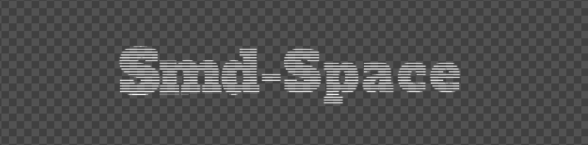

<div align="center">

<p align="center">
  
</p>

# Thousif Ibrahim

**Software Engineer • AI Automation Specialist • Enterprise Solutions**

<br>

*Building intelligent solutions with Python, .NET, Angular & Power BI*

<br>

[](https://linkedin.com/in/thousif-ibrahim-29050421b)
[](https://github.com/smdspace-dev)
[](mailto:ahilxdesigns@gmail.com)

**For freelance work?** → [reach out](mailto:ahilxdesigns@gmail.com) ✨

</div>

---

<div align="center">

## 🚀 Core Technologies


**AI Automation** • **Azure Cloud** • **Enterprise Automation**

</div>

---

<div align="center">

### 📊 Weekly development breakdown

<!--START_SECTION:waka-->

```txt
Requirements    15 hrs          ██████████████████▒░░░░░░   43.00 %
Architecture     5 hrs          ███▒░░░░░░░░░░░░░░░░░░░░░   14.00 %
Logic's          3 hrs          ██▒░░░░░░░░░░░░░░░░░░░░░░   09.00 %
Coding          10 hrs          ▓░░░░░░░░░░░░░░░░░░░░░░░░   29.00 %
Fixing bugs      2 hrs          ▒░░░░░░░░░░░░░░░░░░░░░░░░   05.00 %
```

<!--END_SECTION:waka-->

</div>

---

<div align="center">

## 📈 github stats


<br>

**Current Focus:** Software Developer @ TTG Pvt Ltd, UK

</div>

---

<div align="center">

<br>

**Repository:** [smdspace-dev](https://github.com/smdspace-dev/smdspace-dev.git)

<br>

<!-- 
 -->
<!--  -->

<br>

**Thank you..**

</div>

